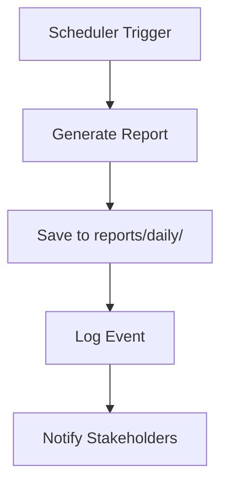
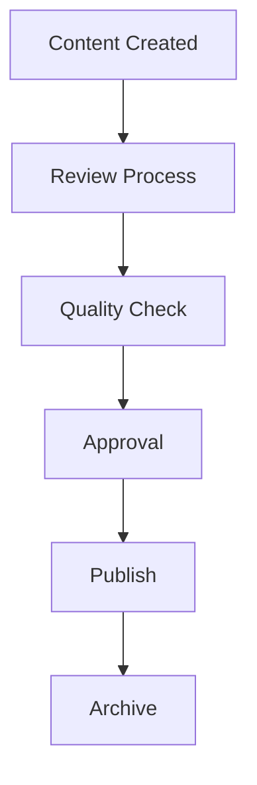

# Content Publishing Playbook

## Overview

This playbook outlines the process for publishing content generated by the Karl AI Ecosystem, including reports, documentation, and other outputs.

## Content Types

### 1. Daily Reports
- **Source**: Generated by CoreHub scheduler
- **Location**: `reports/daily/YYYY-MM-DD.md`
- **Content**: Task completion metrics, system health, costs
- **Publishing**: Automated via scheduler

### 2. PR Reports
- **Source**: Generated by DevAgent
- **Location**: `reports/prs/PR-T-XXX.md`
- **Content**: Code changes, test results, review checklist
- **Publishing**: Manual review and approval

### 3. System Documentation
- **Source**: Manual updates and DevAgent generation
- **Location**: `README.md`, component-specific docs
- **Content**: API documentation, usage guides, architecture
- **Publishing**: Version-controlled via Git

## Publishing Workflow

### Automated Content


### Manual Content


## Content Standards

### Daily Reports
- **Format**: Markdown
- **Template**: `reports/templates/daily.md`
- **Sections**: Completed tasks, metrics, incidents, next actions
- **Retention**: 30 days

### PR Reports
- **Format**: Markdown
- **Template**: Generated by DevAgent
- **Sections**: Changes, files, tests, review checklist
- **Retention**: Permanent (archived)

### Documentation
- **Format**: Markdown
- **Standards**: Follow project documentation guidelines
- **Review**: Required for all changes
- **Versioning**: Git-based

## Quality Gates

### Pre-Publishing Checklist
- [ ] Content follows template structure
- [ ] All required sections present
- [ ] No sensitive information exposed
- [ ] Grammar and spelling checked
- [ ] Links and references valid

### Approval Process
1. **Auto-generated content**: System approval
2. **Manual content**: Human review required
3. **Sensitive content**: Executive approval required

## Distribution Channels

### Internal
- **Dashboard**: Web interface for real-time viewing
- **Email**: Daily digest to stakeholders
- **Slack/Teams**: Notifications for critical events

### External (Future)
- **Blog**: Public documentation and insights
- **API**: Programmatic access to reports
- **Export**: PDF/Excel formats for stakeholders

## Monitoring and Analytics

### Content Metrics
- **Views**: Track content consumption
- **Engagement**: Time spent on reports
- **Feedback**: User ratings and comments
- **Performance**: Load times and availability

### Quality Metrics
- **Accuracy**: Data validation results
- **Completeness**: Required sections present
- **Timeliness**: Delivery within SLA
- **User Satisfaction**: Feedback scores

## Troubleshooting

### Common Issues

#### Content Not Generated
```bash
# Check scheduler status
curl http://localhost:8000/admin/flags

# Check logs
tail -f logs/corehub.log | grep "daily_report"

# Manual generation
curl http://localhost:8000/report/daily
```

#### Content Format Issues
```bash
# Validate template
cat reports/templates/daily.md

# Check generated content
ls -la reports/daily/

# Test template rendering
python -c "
from corehub.api.routes.report import _generate_daily_report_content
print(_generate_daily_report_content('2025-10-22'))
"
```

#### Publishing Failures
```bash
# Check file permissions
ls -la reports/

# Check disk space
df -h

# Check service status
docker-compose ps
```

## Future Enhancements

### Planned Features
- **Multi-language support**: Spanish/English content
- **Custom templates**: User-defined report formats
- **Real-time updates**: WebSocket notifications
- **Advanced analytics**: ML-powered insights
- **Integration APIs**: Third-party system integration

### Content Automation
- **AI-generated summaries**: Automated insights
- **Trend analysis**: Historical data patterns
- **Predictive content**: Forecast-based reports
- **Personalization**: User-specific content

## Security Considerations

### Data Protection
- **Sensitive data**: Never include in public content
- **Access control**: Role-based content access
- **Audit trail**: Track all content changes
- **Encryption**: Secure content storage

### Compliance
- **Data retention**: Follow legal requirements
- **Privacy**: Protect user information
- **Accessibility**: Ensure content is accessible
- **Backup**: Regular content backups

## Best Practices

### Content Creation
1. **Consistency**: Follow established templates
2. **Clarity**: Use clear, concise language
3. **Accuracy**: Verify all data and metrics
4. **Timeliness**: Publish within agreed timeframes

### Content Management
1. **Version control**: Track all changes
2. **Review process**: Multiple review stages
3. **Quality assurance**: Automated and manual checks
4. **Feedback loop**: Continuous improvement

### Content Distribution
1. **Multi-channel**: Reach all stakeholders
2. **Accessibility**: Ensure easy access
3. **Performance**: Optimize for speed
4. **Monitoring**: Track delivery success

---

**Content Publishing** - Delivering insights and value through automated content generation 📊
