# Dev Workflow - Karl AI Ecosystem

## Flujo de Desarrollo

### 1. Tarea → Rama → Código → Tests → Docs → PR → Merge

```mermaid
graph TD
    A[Tarea del Kanban] --> B[Crear Rama]
    B --> C[Desarrollar Código]
    C --> D[Escribir Tests]
    D --> E[Actualizar Docs]
    E --> F[Crear PR]
    F --> G[Code Review]
    G --> H[Merge a Main]
    H --> I[Deploy]
```



### 2. Workflow Detallado

#### Paso 1: Obtener Tarea
```bash
# Ver tareas disponibles
curl http://localhost:8000/tasks/

# Obtener siguiente tarea
curl -X POST http://localhost:8000/tasks/next \
  -H "Content-Type: application/json" \
  -d '{"agent": "devagent"}'
```

#### Paso 2: Crear Rama
```bash
# Crear rama para la tarea
git checkout -b feat/T-101-implement-endpoint

# O usando DevAgent
poetry run python -m agents.devagent.app.main run --task-id T-101
```

#### Paso 3: Desarrollar
```bash
# Arrancar CoreHub en desarrollo
make dev

# En otra terminal, ejecutar DevAgent
poetry run python -m agents.devagent.app.main run_once
```

#### Paso 4: Tests
```bash
# Ejecutar tests
make test

# Tests específicos
poetry run pytest corehub/tests/test_api_health.py -v

# Coverage
poetry run pytest --cov=corehub --cov-report=html
```

#### Paso 5: Linting
```bash
# Formatear código
make fmt

# Verificar linting
make lint

# Auto-fix issues
poetry run ruff --fix corehub/ agents/
```

#### Paso 6: Documentación
```bash
# Actualizar README si es necesario
# Agregar docstrings a funciones nuevas
# Actualizar changelog
```

#### Paso 7: Commit y PR
```bash
# Commit
git add .
git commit -m "feat: implement T-101 endpoint

- Add new /classify endpoint
- Add tests for endpoint
- Update documentation

Closes T-101"

# Push
git push origin feat/T-101-implement-endpoint

# Crear PR (manual o automático)
```

## Comandos Útiles

### Desarrollo Local
```bash
# Setup completo
make setup

# Desarrollo
make dev              # Arrancar CoreHub
make devagent         # Ejecutar DevAgent una vez
make devagent-loop    # DevAgent en loop

# Testing
make test             # Todos los tests
make test-corehub     # Solo CoreHub tests
make test-devagent    # Solo DevAgent tests

# Quality
make fmt              # Formatear código
make lint             # Linting
make all              # Formato + lint + test
```

### Base de Datos
```bash
# Migraciones
make db-migrate       # Aplicar migraciones
make db-revision      # Crear nueva migración
make db-reset         # Resetear DB (¡CUIDADO!)

# Ejemplo de nueva migración
make db-revision --message "Add user table"
```

### Monitoreo
```bash
# Health check
curl http://localhost:8000/health

# Reporte diario
curl http://localhost:8000/report/daily

# Eventos del sistema
curl http://localhost:8000/events/

# Pausar sistema
curl -X POST http://localhost:8000/admin/pause \
  -H "Content-Type: application/json" \
  -d '{"paused": true}'
```

## Troubleshooting Común

### 1. CoreHub no arranca
```bash
# Verificar dependencias
poetry install

# Verificar base de datos
poetry run alembic upgrade head

# Verificar variables de entorno
cat .env

# Logs detallados
poetry run uvicorn corehub.api.main:app --reload --log-level debug
```

### 2. DevAgent no encuentra tareas
```bash
# Verificar CoreHub está corriendo
curl http://localhost:8000/health

# Verificar kanban
cat configs/kanban.json

# Verificar sistema no está pausado
curl http://localhost:8000/admin/pause
```

### 3. Tests fallan
```bash
# Limpiar cache
make clean

# Reinstalar dependencias
poetry install --sync

# Ejecutar tests con verbose
poetry run pytest -v --tb=short

# Tests específicos
poetry run pytest corehub/tests/test_api_health.py::test_health_check_basic -v
```

### 4. Linting errors
```bash
# Auto-fix
poetry run ruff --fix corehub/ agents/

# Verificar configuración
cat pyproject.toml | grep -A 20 "\[tool.ruff\]"

# Ignorar reglas específicas
# En el código: # ruff: noqa: E501
```

### 5. Coverage bajo
```bash
# Ver coverage por archivo
poetry run pytest --cov=corehub --cov-report=term-missing

# Excluir archivos de coverage
# En pyproject.toml:
[tool.coverage.run]
omit = ["*/tests/*", "*/migrations/*"]
```

### 6. Performance issues
```bash
# Profile de performance
poetry run python -m cProfile -o profile.stats corehub/api/main.py

# Memory profiling
poetry run pip install memory-profiler
poetry run python -m memory_profiler corehub/api/main.py
```

## Debugging

### 1. Logs del Sistema
```bash
# Logs de CoreHub
poetry run uvicorn corehub.api.main:app --reload --log-level debug

# Logs de DevAgent
poetry run python -m agents.devagent.app.main run_once --log-level debug
```

### 2. Base de Datos
```bash
# Conectar a DB
psql $POSTGRES_URL

# Ver tablas
\dt

# Ver datos
SELECT * FROM tasks LIMIT 10;
SELECT * FROM events ORDER BY created_at DESC LIMIT 10;
```

### 3. API Debugging
```bash
# Test endpoints manualmente
curl -X POST http://localhost:8000/tasks/next \
  -H "Content-Type: application/json" \
  -d '{"agent": "devagent"}' \
  -v

# Ver eventos
curl http://localhost:8000/events/ | jq
```

## Best Practices

### 1. Git Workflow
```bash
# Commits descriptivos
git commit -m "feat: add user authentication

- Add JWT token validation
- Add user login endpoint
- Add password hashing
- Add tests for auth flow

Closes T-102"

# Branches descriptivas
feat/T-101-add-endpoint
fix/T-102-auth-bug
docs/T-103-update-readme
```

### 2. Testing
```python
# Test naming
def test_get_user_by_id_success():
    """Test successful user retrieval by ID."""
    pass

def test_get_user_by_id_not_found():
    """Test user retrieval when user not found."""
    pass

def test_get_user_by_id_invalid_id():
    """Test user retrieval with invalid ID format."""
    pass
```

### 3. Error Handling
```python
# Logging estructurado
logger.info("Processing task", task_id=task_id, priority=priority)
logger.error("Task processing failed", task_id=task_id, error=str(e))

# Excepciones específicas
class TaskNotFoundError(Exception):
    """Raised when task is not found."""
    pass

class InvalidTaskStatusError(Exception):
    """Raised when task status is invalid."""
    pass
```

### 4. Configuration
```python
# Variables de entorno
import os
from typing import Optional

DATABASE_URL: str = os.getenv("POSTGRES_URL", "sqlite:///./test.db")
MAX_TASK_SECONDS: int = int(os.getenv("MAX_TASK_SECONDS", "120"))
DEBUG: bool = os.getenv("DEBUG", "false").lower() == "true"
```

## Deployment

### 1. Pre-deployment Checklist
- [ ] Todos los tests pasan
- [ ] Coverage ≥ 70%
- [ ] Linting clean
- [ ] Documentación actualizada
- [ ] Variables de entorno configuradas
- [ ] Base de datos migrada

### 2. Deployment Commands
```bash
# Production deployment
poetry run alembic upgrade head
poetry run uvicorn corehub.api.main:app --host 0.0.0.0 --port 8000

# Con Gunicorn (recomendado para producción)
poetry run gunicorn corehub.api.main:app -w 4 -k uvicorn.workers.UvicornWorker
```

### 3. Post-deployment
```bash
# Health check
curl http://localhost:8000/health

# Verificar métricas
curl http://localhost:8000/report/daily

# Monitorear logs
tail -f logs/corehub.log
```

---

**Recuerda**: El desarrollo es un proceso iterativo. ¡Mantén el código limpio y los tests verdes! 🚀
